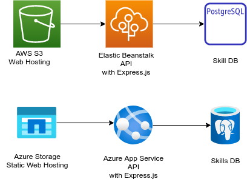

# My engineering web site overview (Backend DB)

- [My engineering web site overview (Backend DB)](#my-engineering-web-site-overview-backend-db)
  - [Experience](#experience)
    - [Table](#table)
  - [Tag](#tag)
    - [Tables](#tables)
  - [relexptag](#relexptag)
  - [Application User](#application-user)
    - [Tables](#tables-1)
  - [Deployment](#deployment)
    - [To AWS](#to-aws)
    - [Connect to DB](#connect-to-db)
    - [To Azure](#to-azure)


## Experience

This is the development experience to list up in the web site.

### Table

```sql
CREATE TABLE IF NOT EXISTS experience (
  id SERIAL,
  title VARCHAR NOT NULL,
  note TEXT,
  urle VARCHAR,
  PRIMARY KEY (id)
);
```

## Tag

### Tables

Tags that can be used to filter the skills category.

```sql
CREATE TABLE IF NOT EXISTS tag (
  id SERIAL,
  tag VARCHAR(8) NOT NULL,
  PRIMARY KEY (id),
  CONSTRAINT tag_unique UNIQUE (tag)
);
```

## relexptag

This table defines the relation between experiences and tags.

```sql
CREATE TABLE IF NOT EXISTS relexptag (
    id SERIAL,
    experience INT,
        FOREIGN KEY (experience)
        REFERENCES experience (id),
    tag INT,
        FOREIGN KEY (tag)
        REFERENCES tag (id),
    PRIMARY KEY (id)
);
```

## Application User

### Tables

The email and passwd should be hashed.

```sql
CREATE TABLE IF NOT EXISTS lvl (
  id SERIAL,
  user VARCHAR,
  email VARCHAR,
  passwd VARCHAR,
  PRIMARY KEY (id)
);
```

## Deployment

Target environment.
Here I am going to try deploying to both AWS and Azure.



### To AWS

### Connect to DB

```
psql -h <aws hosted postgreSQL> -p 5432 -U postgres -d postgres
```

### To Azure

TBD
